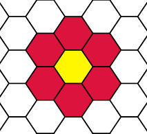
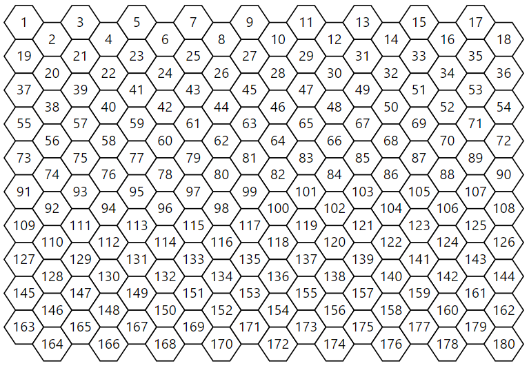

# The Hexagons

</img>
This repository contains the data used to train and evaluate the instruction-to-execution task derived from the Hexagons dataset.
The Hexagons dataset comprises 4176 naturally-occurring visually grounded instructions rich with diverse types and levels of abstractions. <br/>
For more details about the framework of the Hexagons dataset as well as the Hexagons App & Game, 
the abstraction elicitation methodology, dataset and baseline models please refer to our
[paper](https://onlplab.github.io/Hexagons/#paper)
and [website](https://onlplab.github.io/Hexagons/). 

## Dataset

### Download
* [Train](https://onlplab.github.io/Hexagons/tree/main/data/train.jsonl.gz)
* [Dev](hhttps://onlplab.github.io/Hexagons/tree/main/data/dev.jsonl.gz)
* [Test](https://onlplab.github.io/Hexagons/tree/main/data/test.jsonl.gz)


### Dataset Description

For details about the data please refer to the [dataset section](https://onlplab.github.io/Hexagons/dataset/)
in our [website](https://onlplab.github.io/Hexagons/) and to our [paper](https://onlplab.github.io/Hexagons/#paper).

### Data Format

The dataset is split into three files of train, dev and test with with an 80/10/10 ratio of the
drawing procedures (For more details on the split rationale refer to our our [paper](https://onlplab.github.io/Hexagons/#paper)). 
Each file is in a jsonl format where each entry is a dictionary of a single drawing procedure. 
A drawing procedure consists of: 

* `index`: a unique identifier of a drawing procedure marked as a number between 0 and 619 such that the numbers run across train/dev/test in a random order. 
This index is synchornized with the [dataset visualization](https://onlplab.github.io/Hexagons/visual/) index, in order to allow user to visualize the drawing procedure by index.
* `collection_round`: a unique identifier for each round where we collected drawing procedures. The values are:  
     - '1': The first round where we used images designed by the  [project team](https://onlplab.github.io/Hexagons/#team).
     - '2': The second round where we used images designed by the experienced crowdworkers. 
     - '0': Preliminary rounds (results from the Pilot and Recruitment phases).
     
     The split of the drawing procedure indices by the rounds is as follow: 
     - first round consists of indices: 0-302, 492. 
     - second round consists of indices: 303-491, 493-496.
     - prelminary round consists of indices: 497-619. 
* `category`: The abstraction mechanism which the target image of a drawing procedure is intended to trigger. This is _not_ applicable for the second round. 
    The categoties consists of: 'simple', 'bounded iteration', 'conditional iteration', 'conditions', 'recursion', 'symmetry' and 'composed objects' and 'other'. 
    The value 'NONE' refers to drawing procedures from the second round, indicating that no category is associated with that image.
* `image_index`: a unique identifier of an image (task) that is used as a target image for which a drawing procedure is written. The image index consists of 9-10 characters involving numbers and capital letters (e.g., 'P01C02T03') 
* `instructor`: a unique identifier of an Instructor marked as a number between 1 and 38. 24 Instructors participated in the first and second rounds, and 14 more in the preliminary rounds. 
* `number_of_drawing_steps`: the number of drawing steps comprising the drawing procedure (i.e., the length of the drawing procedure).
* `agreement_tags`: a list of tags in the same length of the drawing procedure that indicates 
the level of agreement between the Instructor and the two Verifiers for each drawing step (find details in our [paper](https://onlplab.github.io/Hexagons/#paper)). <br/>
The level of agreement is calculated by the Board-Based _Exact Match_ metric, that is, two executions of the instructions agree if and only if the denotations (i.e., the resulted board states on the Hexagons board) are identical.  <br/>
The tags are arranged in the same order of the drawing steps in the procedure, such that
each tag corresponds to a single drawing procedure. The tags can take one of the following values:  
    - 'A': Both Veirfiers agree with the Instructor.
    - 'V1': Only Verifier 1 agrees with the Instructor*.  
    - 'V2': Only Verifier 2 agrees with the Instructor*. 
    - 'VV': Verifiers agree with each other, but not with the Instructor. 
    - 'F':  Verifiers does not agree with each other, neither with the Instructor.       
    
    *The index next to the Verifiers is meaningless. 'V1' or 'V2' just means that only one Verifier agrees with the Instructor,
    and the index helps us to track which one. <br/>
    For further details on the agreement and metrics please refer to the [dataset section](https://onlplab.github.io/Hexagons/dataset/)
in our [website](https://onlplab.github.io/Hexagons/) and to our [paper](https://onlplab.github.io/Hexagons/#paper). 
* `agreement_scores`:  a list of tuples similar to the `agreement_tags` but the agreement is calculated 
by the Board-Based _F1_ metric. <br/> A single tuple $(s_1, s_2, s_3)$ corresponds to a single drawing procedure where:
    - $s_1$ is the F1 score between the Instrcutor's and Verifier 1's executions.
    - $s_2$ is the F1 score between the Instrcutor's and Verifier 2's executions.
    - $s_3$ is the F1 score between the executions of both Verifiers.
    
    For further details on the agreement and metrics please refer to the [dataset section](https://onlplab.github.io/Hexagons/dataset/)
in our [website](https://onlplab.github.io/Hexagons/) and to our [paper](https://onlplab.github.io/Hexagons/#paper). 
- `drawing_procedure`: A list of lists representing a drawing procedure. A sub-list _[id, instruction, board state]_
 stands for a single drawing step and consists of: 
     - _id_: a number inidcating the drawing step position in the procedure*. 
     - _instructions_: the instructions written by the Instructor in that step.
     - _board state_: a list of 180 digits indicating the resulted board state following the execution of the instructions by the Instructor. <br/>
     The board size is 10 rows x 18 columns and is numbered left-to-right top-to-bottom as follow: <br/>     
     </img> <br/><br/>
     The digits run from 0 to 7 and stands for colors as follow: 
        - '0': white
        - '1': black
        - '2': yellow
        - '3': green
        - '4': red
        - '5': blue
        - '6': purple 
        - '7': orange
    
    *The drawing steps are ordered from the first step to the last step starting with 0. 
    The 0-step stands for the initial board state (i.e., a blank board) prior to the first set of instructions, 
    hence, does not consists of any instruction (the instruction value is actually "NONE"). <br/> Note that the length of a drawing proceudre (i.e., number of drawing steps) does not refer to the 0-step 
    (e.g., a drawing procedure in length of 6 consists of 6 drawing steps numbered from 1 to 6 _in addition_ to the 0-step).
   
     
## Citation
```markdown
@article{hexagons,
  title={Draw me a Flower: {P}rocessing and Grounding Abstraction in Natural Language},
  author={Lachmy, Royi and Pyatkin, Valentina and Manevich, Avshalom and Tsarfaty, Reut},  
  year={2022},
  journal = {Accepted to Transaction of ACL}  
}

```

## Terms of Use
- By downloading the data on this page the user acknowledges that their use will be restricted to research and/or academic purposes only.
- Resources on this page are licensed CC-BY 4.0, a Creative Commons license requiring Attribution (https://creativecommons.org/licenses/by/4.0/).


## Changelog
- `XX/08/2022` The Hexagons dataset is released:  TACL paper + dataset + website.
- `27/06/2021` First arXiv version of the paper is released.

 


