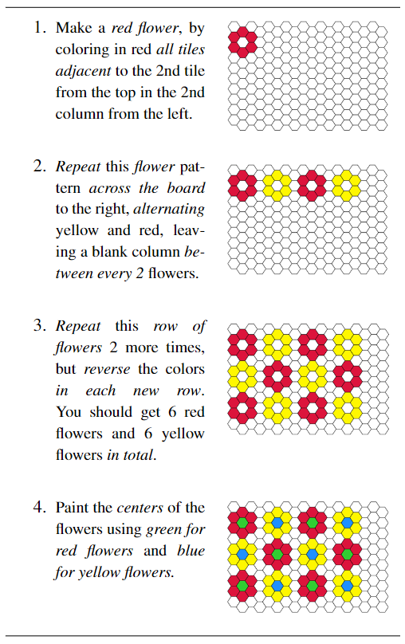

## **Hexagons**

The Natural Language Programming and Computational Thinking (NLPROg-CT) project at the [ONLP lab](https://nlp.biu.ac.il/~rtsarfaty/onlp) strives to explore the mutual interaction between human Computational Thinking and AI/NLP systems in order to contribute to the development of Natural Language Programming as well as advancing human Computational Thinking through Natural Language Programming. 

Our first initiative is the design of the Hexagons [App](/Hexagons/app) and [Game](/Hexagons/game). We use this game to collect the Hexagons dataset which focuses on a prominent Computational Thinking skill, namely, <b> abstraction</b>. This [dataset](/Hexagons/dataset) comprises 4177 naturally-occurring visually grounded instructions rich with diverse
types and levels of abstractions. 

To showcase how this data may be used for studying abstraction processing in NL, we derive an instruction-to-execution task, where the model needs to ground and execute NL
instructions on the Hexagons board. As baselines, we propose two neural modeling alternatives — one based on classification (DeBERTa) and another on generation (T5). Our results show that contemporary models and modeling practices are substantially inferior
to human performance, and that models’ performance is inversely correlated with the
level of abstraction, showing less satisfying performance on higher levels of abstraction.
These findings are consistent across models and setups, confirming that abstraction is a
challenging phenomenon in NLP systems. 

Please refer to our [paper](#paper) for more details.

We invite you to join us in the endeavor to improve models’ abstraction capabilities! <br/>
Explore the Hexagons [App](/Hexagons/app) and [Game](/Hexagons/game), get yourself familiar with the dataset through the [Image Gallery](/Hexagons/gallery) and the [Dataset Visualization](/Hexagons/visual), explore our [Baseline Models](models) capabilities in the [Demo](/Hexagons/demo), and download the [Dataset](/Hexagons/dataset) to devise your own cutting-edge model! 

The project is run by the [NLPROg-CT team](#team), directed by Prof. [Reut Tsarfaty](https://nlp.biu.ac.il/~rtsarfaty/) at  [Bar-Ilan University](https://biu-nlp.github.io/)
and is endorsed by [Allen Institute for AI](https://allenai.org/).  


<center>
    <a href="media/first_page_figure.png"> 
        
      </a>
</center>


## **Paper**

[**Draw me a Flower: Processing and Grounding Abstraction in Natural Language**](https://github.com/OnlpLab/Hexagons/blob/main/publications/Hexagons.pdf)
Royi Lachmy, Valentina Pyatkin, Avshalom Manevich, Reut Tsarfaty
*Accepted to Transaction of ACL*, 2022.

```markdown
@article{hexagons,
  title={Draw me a Flower: {P}rocessing and Grounding Abstraction in Natural Language},
  author={Lachmy, Royi and Pyatkin, Valentina and Manevich, Avshalom and Tsarfaty, Reut},  
  year={2022},
  journal = {Accepted to Transaction of ACL}  
}

```

## **Project Team**
<div>
<a name="team"></a>

<div class="card">
  
  <div class="container">
    <!--  <a href="https://">-->
    <h4><b>Royi Lachmy</b></h4>  
    <!--  </a> -->
  </div>
</div>

<div class="card">
  
  <div class="container">
    <a href="https://valentinapy.github.io/">
    <h4><b>Valentina Pyatkin</b></h4>
    </a>
  </div>
</div>

<div class="card">
  
  <div class="container">
    <!--  <a href="https://">-->
    <h4><b>Avshalom Manevich</b></h4>  
    <!--  </a> -->
  </div>
</div>

<div class="card">
  
  <div class="container">
    <!--  <a href="https://">-->
    <h4><b>Shira Kritchman</b></h4>  
    <!--  </a> -->
  </div>
</div>

<div class="card">
  
  <div class="container">
    <a href="https://nlp.biu.ac.il/~rtsarfaty/">
    <h4><b>Reut Tsarfaty</b></h4>  
    </a>
  </div>
</div>

</div>