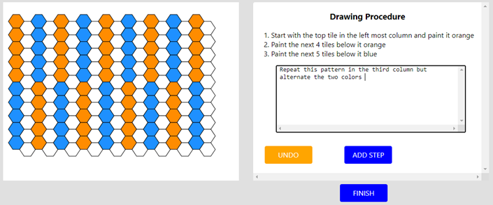
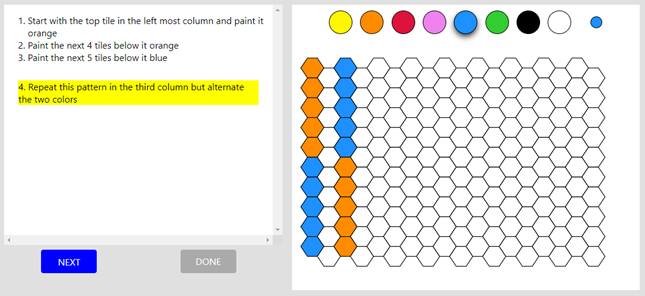

## GAME
The Hexagons game is a 2-player instruction following game. 

&#x1F481; <b> The Instructor </b>   
The Instructor gets a target image on the Hexagons board and has to provide instructions for how to draw the image step by step.   

Click the button to play the Instructor role.  
<a href="https://nlp.biu.ac.il/~royi/hexagon-paper-demo-collection/#/login" class="btn btn-primary btn-sm"  target="_blank">Instructor Demo</a>

&#x1F481;&#127998;&#x200D;&#x2642; <b> The Executor </b>   
The Executor gets the instructions and has to execute them one by one on a blank Hexagons board in order to reconstruct the target image.  

Click the button to play the Executor role.  
<a href="https://nlp.biu.ac.il/~royi/hexagon-paper-demo-verification/#/login" class="btn btn-primary btn-sm"  target="_blank">Executor Demo</a>

