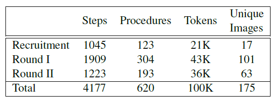
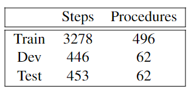

## DATASET
The Hexagons dataset comprises 4177 naturally-occurring visually grounded instructions rich with diverse types and levels of abstractions. 
The dataset as well as the evaluation of its quality is described in the [paper](/Hexagons/#paper).  

The following table summarizes some of its properties.  

The dataset is split into train, dev, and test according to the following table and may be downloaded [here](https://github.com/OnlpLab/Hexagons#download).  

